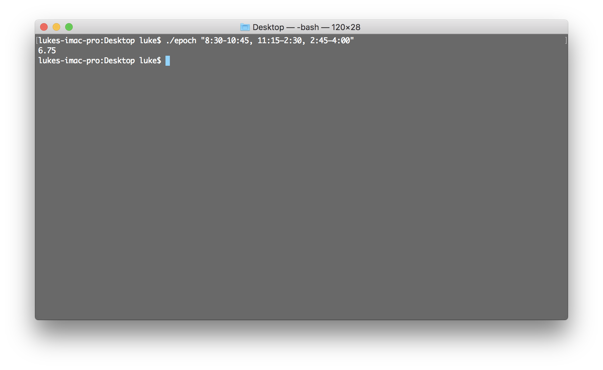

# Epoch


[](https://github.com/lukeify/epoch)



Keeps track of hours worked by entering an arbitrary string such as `"9:30-11:15, 11:45–2:30, 3:00–4:15"`. Will print out hours worked as a decimal and, the future, copy the result to your clipboard.

# User Instructions

Place the script wherever you'd like, then call `./epoch <times>` where `<times>` is a quote-surrounded, comma & space separated listing of the times you've worked, rounded to the nearest quarter of an hour.

For example:

`"9:30-11:15, 11:45–2:30, 3:00–4:15"`

# Getting Started

For those who would like to build and run this application.

## Prerequisites

Ensure you have `rustc` and `cargo` on your machine.

## Installation

```
git clone https://github.com/lukeify/epoch.git
cd epoch
cargo install
```

## Building

```
cargo build --release
```

# Built With

* Rust
* Cargo

# Versioning

Design & functionality of this site uses [semantic versioning](https://semver.org).

# Author

Luke Davia.

# License. 

The contents of this repository is licensed under the [MIT License](LICENSE). For more on this license, [read the summary on tldrlegal.com](https://tldrlegal.com/license/mit-license).